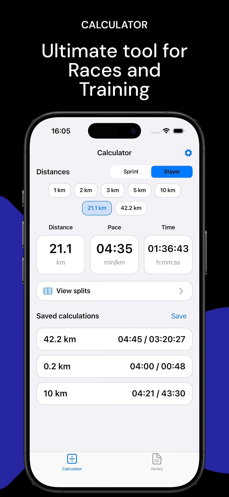
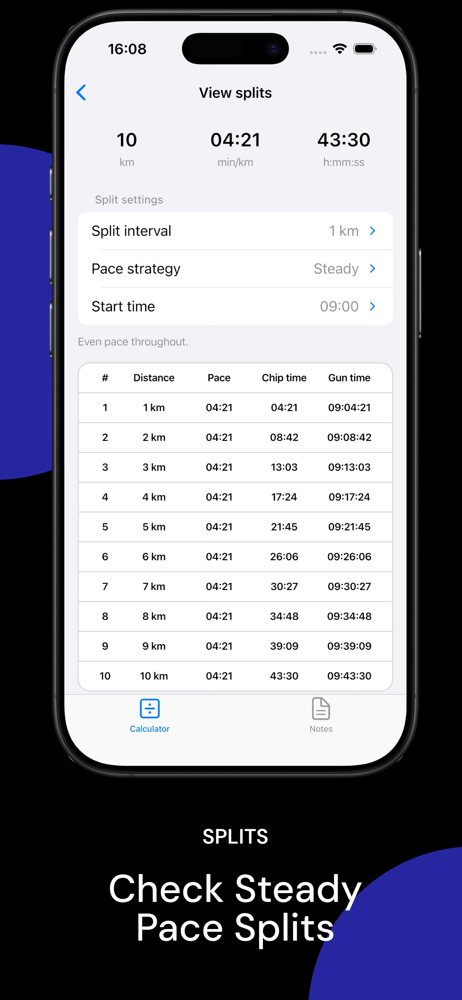

# Racepace


<p align="center">
  <a href="https://github.com/gonfff/racepace/actions/workflows/ci.yml">
    
  </a>
    <a href="https://img.shields.io/badge/platform-iOS-lightgrey">
    
  </a>
    </a>
    <a href="https://img.shields.io/badge/Dart-%5E3.10.3-blue?logo=dart">
    =3.10">
  </a>
  <a href="https://img.shields.io/badge/license-MIT-green.svg">
    
  </a>
</p>

Racepace is an iOS-first Flutter app for runners and cyclists. It provides pace and speed calculators, a BPM metronome, and training notes with support for structured workouts.

## Features


## Screenshots

<p align="center">
  
  
  
  
</p>

## Getting Started

1. **Prereqs**: Flutter 3.38.5 (matches CI), Dart SDK ^3.10.3, Xcode for iOS
   simulator/device builds.
2. **Install deps**:
   ```bash
   flutter pub get
   ```
3. **Run the app**:
   ```bash
   flutter run
   ```

## License

MIT © Denis Dementev
